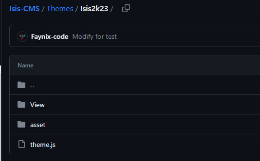

# Création de thèmes

## Création du fichier de thème :&#x20;

Chaque thème se compose d'un fichier portant son nom et est décomposé en sous fichier avec obligation d'ajouter un dossier asset dans la racine de votre fichier de thème.&#x20;

Voici un exemple de l'arborescence à respecter :  

Le fichier theme.js est le fichier principal de votre thème. C'est lui qui regroupe les chemin d'accès vers les différents fichier (View) de votre thème.&#x20;

### Le fichier theme.js

Il doit être présent à la racine de votre fichier de thème comme vu sur l'exemple plus haut et doit contenir ces lignes obligatoires&#x20;

```java
exports.theme_name = "Your Name"
exports.author = "Your Author name "
exports.asset_path = __dirname + '/asset/'
exports.view_path = __dirname + '/View/mainview'
exports.login_path = __dirname + '/View/user/login'
exports.create_path = __dirname + '/View/user/create'
exports.header = __dirname + '/asset/components'
exports.error_path = __dirname + '/View/error.ejs'
exports.index = __dirname +'/View/index.ejs'
```

Voici les information sur les différentes valeurs présentes ainsi que les valeurs optionnelles&#x20;

| Nom          | Valeur                                                                                              |
| ------------ | --------------------------------------------------------------------------------------------------- |
| theme\_name  | (Obligatoire)Le nom de votre thème                                                                  |
| author       | (Obligatoire)Le nom de l'auteur du thème                                                            |
| asset\_path  | (Obligatoire)Le chemin des assets (Ne pas changer sauf si vous voulez un autre dossier d'asset.) .  |
| view\_path   | (Obligatoire)Le chemin vers une vue utilisé par les pages générés par l'utilisateur                 |
| login\_path  | (Obligatoire) Le chemin vers la page de connexion.                                                  |
| create\_path | (Obligatoire) Le chemin vers la page de création de compte                                          |
| header       | (Obligatoire) Le chemin vers le ou les header disponible par exemple : header\_js.ejs               |
| index        | (Obligatoire) Le chemin vers la page principal du thème                                             |
| error\_path  | (Optionel) Chemin vers le design d'une page d'erreur                                                |
| sucess       | (Optionel) Chemin vers le design d'une page des succès                                              |
| profil       | (Optionel) Chemin vers une page de profil                                                           |

